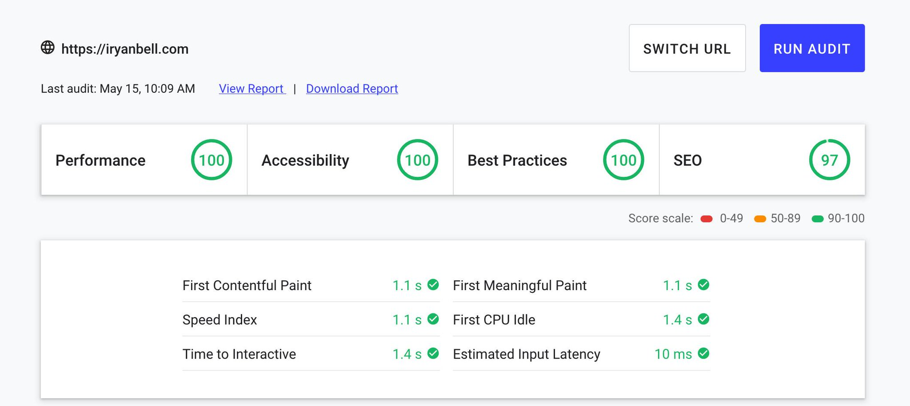

I've been experimenting with a new publishing system that is lightning fast, open-source, and highly modular.

We take a simple human-readable document format, wrap it in a device-agnostic clean, reader-friendly layout with sharp typography, then deploy it through a performance-tuned backend over a repository-linked CDN.

Gone are the days of CMS publishing, PHP configurations, and manual image compression optimization. **Straight outta the box, we can light up a Lighthouse Audit with Green.**



**Can your site do that?** https://web.dev

## Get down with markdown

Here's a sample of this blog post, up until this point: 👇   

```markdown
---
title: Blogging In Style With Material, GatsbyJS, GraphQL, and ReactJS
date: "2019-05-26"
description: "I've been experimenting with a new publishing system that is lightning fast, open-source, and highly modular."
featured:
    image: "./featured.png"
    alt: "Featured Image: GatsbyJS Logo over a motocycle engine."
---

I've been experimenting with a new publishing system that is lightning fast, open-source, and highly modular.

We take a simple human-readable document format, wrap it in a device-agnostic clean, reader-friendly layout with sharp typography, then deploy it through a performance-tuned backend over a repository-linked CDN.

Gone are the days of CMS publishing, PHP configurations, and manual image compression optimization. **Straight outta the box, we can light up a Lighthouse Audit with Green.**


**Can your site do that?** https://web.dev

## Get down with markdown

Here's a sample of this blog post, up until this point: 👇   
```

A small **frontmatter** header written in a **YAML** format inserts all of the metadata we need for SEO optimization and house-keeping. Images are lazy-loaded as needed with server-side compression, and all of our content is sorted by date in the filesystem directory by using a **YYYY-MM-DD** format. We apply pagination and connect each post to its nearest neighbors.

Pretty simple, right?


## Deployment

To get this up and running, check out https://netlify.com.

You can create a .git repository for your blog, then sync it to a private GitHub repo. You just point your DNS to Netlify, then Netlify to your repo, and it will ✨automagically✨ build a new static site whenever you update your content, hosted over a secure CDN.

## Linkage

Follow @iRyanBell on twitter: https://twitter.com/iRyanBell   
More content at: https://iRyanBell.com
